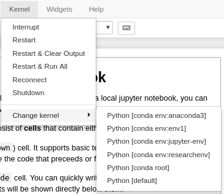

# Lesson 4
Today we will jump into one of the main reasons to learn Python: its many **packages**. We will learn to install and manage packages with **Anaconda**, and import **modules** of the packages to use in our own code. Let's get started!

## Importing modules
In this interactive example we will learn to import modules with two core scientific Python packages: **numpy** and **matplotlib**.

[Part1: Modules](https://mybinder.org/v2/gh/cjtu/sci_coding/master?filepath=lessons%2Flesson4%2Fdata%2F1_Modules.ipynb)

## The Anaconda package manager
Anaconda exists to simplify the installation and management of Python packages. It automatically installs *dependencies*, other packages that the package you are using needs to work properly. It also checks those packages to see if *they* depend on other packages and then installs those too.

### Dependency conflicts
One issue you may run into is called a *dependency conflict*. Say `package1` requires a dependency, say `pydep version 2.1`. When you run `conda install package1`, it will see the dependency and install `package1` along with `pydep version 2.1`. Now for another project, you need to use `package2`. The problem is that this package depends on `pydep version 1.8`. When you run `conda install package2`, it will find this dependency and *downgrade* `pydep` to version 1.8. But this may cause `package1` to stop working.

### Conda environments
Anaconda solves this issue by allow us to create *virtual environments* call **conda environments**. This is a special installation of Anaconda that you can install specific packages to while keeping it separate from your other packages. This helps avoid dependency conflicts, and can allow you to keep your scientific code to the minimum number of packages necessary to run it. That way, when you want to share this code with others, they simply have to install the list of packages you were running it with and it is guaranteed to work.

To make a conda environment, we use the command `conda create`. We need to specify a name of the environment with `-n`. We can also specify some packages we want to install right away.

```bash
conda create -n researchenv numpy matplotlib jupyter
```

Note: if you want to install all of the packages bundled with Anaconda, you can type `conda create -n name anaconda`.

Once it searches through all of the dependencies of the packages you specified, it will begin installing them in a self-contained environment called `researchenv`.

To activate an environment, type `source activate name`. To deactivate an environment, type `source deactivate`. Try activating your new conda environment and listing the installed packages. 

```bash
source activate researchenv
conda list
```

Note: If you will be working in Jupyter notebooks in conda environments, a very useful package to have installed is [nb_conda_kernels](https://github.com/Anaconda-Platform/nb_conda_kernels). This allows you to change your active conda environment from within the Jupyter interface. Let's install it now.

```bash
conda install nb_conda_kernels
```

Now if you start a Jupyter server and login on your browser, you should be a new option in `Kernel -> Change kernel -> [list of conda envs]` (see image below).



You will need to install this package in each environment that you would like to be able to switch to.

Now that we have a conda env set up, let's try installing a new package. Make sure your environment is active. If not, type `source activate researchenv` first.

```bash
conda install astropy
```

Now let's check our installed packages. We should see `astropy` and the other dependencies in the list.
```bash
conda list
```

### Sharing environments
Say we want to send our environment as is to a collaborator so that they can run some code that we wrote. With Anaconda, we can export our current environment to an `environment.yml` config file, then our collaborator can rebuild our environment with that file.

The command is simple. From within the environment we want to share, type:
```
conda env export > environment.yml
```

Now we have an `environment.yml` file that looks something like this:
```yaml
name: stats
dependencies:
  - numpy
  - pandas
```

If we send this file to a collaborator, they simply need to have Anaconda installed and type the following (you can try this to see that it works).
```bash
conda env create -n newenv -f environment.yml
source activate newenv
```

This will set up the conda environment exactly as you had it and allow them to run your code with the exact same settings as you do.

Everything you need to know about Anaconda environments is available [here](https://conda.io/docs/user-guide/tasks/manage-environments.html), or is a short Google search away.

## Loops
The following short tutorial will introduce loops, a useful programming concept for doing things multiple times.

[Part2: Loops](https://mybinder.org/v2/gh/cjtu/sci_coding/master?filepath=lessons%2Flesson4%2Fdata%2F2_Loops.ipynb)


## You made it!
Hopefully you now have a grasp of the basics of Python and how to find help when you get stuck. Along the way, we learned some tools like Git, Anaconda and Jupyter that I hope you will use to improve the reproducibility of your scientific code, as well as the ease of working with collaborators.  

Next week we will put all we've learned together and collaborate on a research problem in Git.